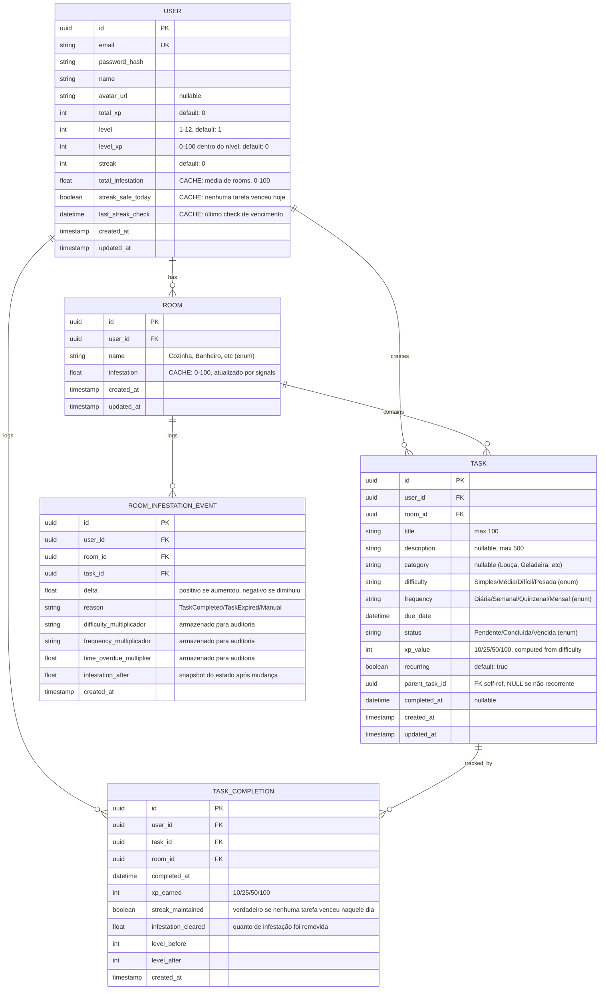

# No Rats — Modelo de Dados & Arquitetura

## 1. Diagrama ER (Mermaid)



---

## 2. Models Django

```python
# models.py

from django.db import models
from django.core.validators import MinValueValidator, MaxValueValidator
from django.utils.translation import gettext_lazy as _
from django.db.models.signals import post_save, post_delete
from django.dispatch import receiver
import uuid
from datetime import datetime, timedelta
from decimal import Decimal

# ============================================================================
# USER MODEL
# ============================================================================

class User(models.Model):
    """
    Usuário do No Rats.
    
    Fields desnormalizados:
    - total_xp, level, level_xp: XP acumulado + progressão
    - streak: dias consecutivos sem vencimento
    - total_infestation: CACHE (recalculado via signal após Room update)
    - streak_safe_today: CACHE (verdadeiro se nenhuma tarefa venceu hoje)
    - last_streak_check: controla quando fazer check de vencimento
    """
    
    id = models.UUIDField(primary_key=True, default=uuid.uuid4, editable=False)
    email = models.EmailField(unique=True, db_index=True)
    password = models.CharField(max_length=255)  # será hashed via Django
    name = models.CharField(max_length=150)
    avatar_url = models.URLField(blank=True, null=True)
    
    # XP e Progressão
    total_xp = models.IntegerField(
        default=0,
        validators=[MinValueValidator(0)],
        help_text="XP total acumulado do usuário"
    )
    level = models.IntegerField(
        default=1,
        validators=[MinValueValidator(1), MaxValueValidator(12)],
        help_text="Nível atual (1-12)"
    )
    level_xp = models.IntegerField(
        default=0,
        validators=[MinValueValidator(0), MaxValueValidator(100)],
        help_text="XP dentro do nível atual (progressão 0-100%)"
    )
    
    # Streak
    streak = models.IntegerField(
        default=0,
        validators=[MinValueValidator(0)],
        help_text="Dias consecutivos sem deixar tarefa vencer"
    )
    streak_safe_today = models.BooleanField(
        default=True,
        help_text="CACHE: true se nenhuma tarefa venceu hoje"
    )
    last_streak_check = models.DateTimeField(
        auto_now_add=True,
        help_text="Último momento que checamos vencimentos"
    )
    
    # Infestação
    total_infestation = models.FloatField(
        default=0.0,
        validators=[MinValueValidator(0), MaxValueValidator(100)],
        help_text="CACHE: média aritmética das infestações de todos os cômodos"
    )
    
    created_at = models.DateTimeField(auto_now_add=True)
    updated_at = models.DateTimeField(auto_now=True)
    
    class Meta:
        db_table = 'users'
        ordering = ['-created_at']
    
    def __str__(self):
        return f"{self.name} (Nível {self.level}, XP: {self.total_xp})"
    
    def get_xp_for_next_level(self):
        """Retorna XP necessário para próximo nível baseado em SPEC.md"""
        xp_table = {
            1: 100,
            2: 200,
            3: 300,
            4: 400,
            5: 500,
            6: 600,
            7: 700,
            8: 800,
            9: 900,
            10: 1000,
            11: 1200,
            12: 0,  # sem progressão após 12
        }
        return xp_table.get(self.level, 0)
    
    def recalculate_total_infestation(self):
        """
        CACHE: Recalcula média de infestação de todas as rooms do usuário.
        Chamado por signal após Room.infestation mudar.
        """
        rooms = self.room_set.all()
        if not rooms.exists():
            self.total_infestation = 0.0
        else:
            avg = rooms.aggregate(
                avg_inf=models.Avg('infestation')
            )['avg_inf'] or 0.0
            self.total_infestation = round(avg, 2)
        self.save(update_fields=['total_infestation', 'updated_at'])


# ============================================================================
# ROOM MODEL
# ============================================================================

class Room(models.Model):
    """
    Cômodo da casa do usuário.
    
    Desnormalização: infestation é atualizado por signal/job
    ao invés de agregado a cada leitura.
    """
    
    ROOM_CHOICES = (
        ('cozinha', _('Cozinha')),
        ('banheiro', _('Banheiro')),
        ('quarto', _('Quarto')),
        ('sala', _('Sala')),
        ('lavanderia', _('Lavanderia')),
        ('escritorio', _('Escritório')),
    )
    
    id = models.UUIDField(primary_key=True, default=uuid.uuid4, editable=False)
    user = models.ForeignKey(User, on_delete=models.CASCADE)
    name = models.CharField(max_length=50, choices=ROOM_CHOICES)
    
    infestation = models.FloatField(
        default=0.0,
        validators=[MinValueValidator(0), MaxValueValidator(100)],
        help_text="CACHE: 0-100, atualizado por signal quando tarefa completa/vence"
    )
    
    created_at = models.DateTimeField(auto_now_add=True)
    updated_at = models.DateTimeField(auto_now=True)
    
    class Meta:
        db_table = 'rooms'
        unique_together = ('user', 'name')
        ordering = ['name']
    
    def __str__(self):
        return f"{self.user.name} - {self.get_name_display()} ({self.infestation}%)"
    
    def add_infestation(self, delta):
        """
        Aumenta/diminui infestação com cap 0-100.
        Chamado por signal ou job ao vencer/completar tarefa.
        """
        new_inf = max(0, min(100, self.infestation + delta))
        self.infestation = round(new_inf, 2)
        self.save(update_fields=['infestation', 'updated_at'])
        # Trigger recalculate no usuário
        self.user.recalculate_total_infestation()


# ============================================================================
# TASK MODEL
# ============================================================================

class Task(models.Model):
    """
    Tarefa individual.
    
    Status flow: Pendente → [vence] → Vencida
                    ↓
                Concluída [cria nova se recurring]
    """
    
    DIFFICULTY_CHOICES = (
        ('simples', _('Simples'), 10),
        ('media', _('Média'), 25),
        ('dificil', _('Difícil'), 50),
        ('pesada', _('Pesada'), 100),
    )
    
    DIFFICULTY_MAP = {
        'simples': 10,
        'media': 25,
        'dificil': 50,
        'pesada': 100,
    }
    
    FREQUENCY_CHOICES = (
        ('diaria', _('Diária')),
        ('semanal', _('Semanal')),
        ('quinzenal', _('Quinzenal')),
        ('mensal', _('Mensal')),
    )
    
    FREQUENCY_DAYS = {
        'diaria': 1,
        'semanal': 7,
        'quinzenal': 14,
        'mensal': 30,
    }
    
    STATUS_CHOICES = (
        ('pendente', _('Pendente')),
        ('concluida', _('Concluída')),
        ('vencida', _('Vencida')),
    )
    
    id = models.UUIDField(primary_key=True, default=uuid.uuid4, editable=False)
    user = models.ForeignKey(User, on_delete=models.CASCADE)
    room = models.ForeignKey(Room, on_delete=models.CASCADE)
    
    title = models.CharField(max_length=100)
    description = models.TextField(blank=True, null=True, max_length=500)
    category = models.CharField(max_length=50, blank=True, null=True)
    
    difficulty = models.CharField(max_length=20, choices=DIFFICULTY_CHOICES)
    frequency = models.CharField(max_length=20, choices=FREQUENCY_CHOICES)
    
    due_date = models.DateTimeField(db_index=True)
    status = models.CharField(
        max_length=20,
        choices=STATUS_CHOICES,
        default='pendente',
        db_index=True
    )
    
    xp_value = models.IntegerField(
        validators=[MinValueValidator(10)],
        help_text="XP a ganhar ao completar (10/25/50/100)"
    )
    
    recurring = models.BooleanField(
        default=True,
        help_text="True se cria nova tarefa após conclusão"
    )
    parent_task = models.ForeignKey(
        'self',
        on_delete=models.SET_NULL,
        null=True,
        blank=True,
        related_name='recurrences',
        help_text="Referencia tarefa pai se for recorrente"
    )
    
    completed_at = models.DateTimeField(
        null=True,
        blank=True,
        db_index=True
    )
    
    created_at = models.DateTimeField(auto_now_add=True)
    updated_at = models.DateTimeField(auto_now=True)
    
    class Meta:
        db_table = 'tasks'
        indexes = [
            models.Index(fields=['user', 'status']),
            models.Index(fields=['user', 'room', 'status']),
            models.Index(fields=['due_date', 'status']),
        ]
        ordering = ['-created_at']
    
    def __str__(self):
        return f"{self.title} ({self.room.get_name_display()}) - {self.status}"
    
    def is_overdue(self):
        """Verifica se tarefa venceu"""
        if self.status in ['concluida', 'vencida']:
            return False
        return datetime.now() > self.due_date
    
    def calculate_infestation_delta(self):
        """
        Calcula quanto de infestação esta tarefa causará ao vencer.
        Fórmula: dificuldade × frequência × tempo_vencimento
        """
        # Multiplicadores
        difficulty_map = {
            'simples': 2,
            'media': 4,
            'dificil': 8,
            'pesada': 15,
        }
        
        frequency_map = {
            'diaria': 1.5,
            'semanal': 1.0,
            'quinzenal': 0.8,
            'mensal': 0.5,
        }
        
        # Tempo vencido
        now = datetime.now()
        if now <= self.due_date:
            time_mult = 1.0
        else:
            hours_overdue = (now - self.due_date).total_seconds() / 3600
            if hours_overdue <= 24:
                time_mult = 1.0
            elif hours_overdue <= 72:
                time_mult = 1.3
            elif hours_overdue <= 168:
                time_mult = 1.6
            else:
                time_mult = 2.0
        
        delta = (
            difficulty_map[self.difficulty]
            * frequency_map[self.frequency]
            * time_mult
        )
        
        # Cap individual em 15 (não deixa um vencimento sozinho explodir)
        return min(15, delta)
    
    def complete(self):
        """
        Marca tarefa como concluída.
        Lógica real fica no signal/serializer (não aqui).
        """
        self.status = 'concluida'
        self.completed_at = datetime.now()
        self.save()
    
    def mark_expired(self):
        """
        Marca tarefa como vencida (chamado por background job).
        """
        if self.status == 'pendente':
            self.status = 'vencida'
            self.save(update_fields=['status', 'updated_at'])


# ============================================================================
# TASK COMPLETION MODEL (HISTÓRICO & AUDITORIA)
# ============================================================================

class TaskCompletion(models.Model):
    """
    Registro cada vez que uma tarefa é concluída.
    
    Justificativa:
    - Auditoria: saber quando/o quê foi completado
    - XP histórico: para análise de padrões
    - Streak tracking: saber se venceu no dia da conclusão
    - Sem reprocessamento: não precisa renalysar Task.completed_at
    """
    
    id = models.UUIDField(primary_key=True, default=uuid.uuid4, editable=False)
    user = models.ForeignKey(User, on_delete=models.CASCADE)
    task = models.ForeignKey(Task, on_delete=models.CASCADE, related_name='completions')
    room = models.ForeignKey(Room, on_delete=models.CASCADE)
    
    completed_at = models.DateTimeField(auto_now_add=True, db_index=True)
    
    xp_earned = models.IntegerField(
        validators=[MinValueValidator(10)],
        help_text="10/25/50/100 baseado em difficulty no momento da conclusão"
    )
    
    streak_maintained = models.BooleanField(
        default=True,
        help_text="True se nenhuma outra tarefa venceu no dia da conclusão"
    )
    
    infestation_cleared = models.FloatField(
        default=0.0,
        validators=[MinValueValidator(0)],
        help_text="Quanto de infestação foi removida (se tarefa tinha vencido)"
    )
    
    level_before = models.IntegerField(
        help_text="Nível do usuário antes desta conclusão"
    )
    level_after = models.IntegerField(
        help_text="Nível após conclusão (se subiu)"
    )
    
    created_at = models.DateTimeField(auto_now_add=True)
    
    class Meta:
        db_table = 'task_completions'
        indexes = [
            models.Index(fields=['user', 'completed_at']),
            models.Index(fields=['task', 'completed_at']),
        ]
        ordering = ['-completed_at']
    
    def __str__(self):
        return f"{self.user.name} completou {self.task.title} em {self.completed_at}"


# ============================================================================
# ROOM INFESTATION EVENT (AUDITORIA)
# ============================================================================

class RoomInfestationEvent(models.Model):
    """
    Log de cada mudança de infestação em um cômodo.
    
    Justificativa:
    - Auditoria: rastrear origem de cada infestação
    - Debugging: entender por que um cômodo está sujo
    - Analytics: padrões de negligência por cômodo
    """
    
    REASON_CHOICES = (
        ('task_completed', _('Tarefa Completada')),
        ('task_expired', _('Tarefa Vencida')),
        ('manual_adjustment', _('Ajuste Manual')),
    )
    
    id = models.UUIDField(primary_key=True, default=uuid.uuid4, editable=False)
    user = models.ForeignKey(User, on_delete=models.CASCADE)
    room = models.ForeignKey(Room, on_delete=models.CASCADE)
    task = models.ForeignKey(Task, on_delete=models.CASCADE, null=True, blank=True)
    
    delta = models.FloatField(
        help_text="Positivo se aumentou, negativo se diminuiu"
    )
    reason = models.CharField(max_length=30, choices=REASON_CHOICES)
    
    # Snapshot de multiplicadores (para auditoria)
    difficulty_multiplier = models.FloatField(null=True, blank=True)
    frequency_multiplier = models.FloatField(null=True, blank=True)
    time_overdue_multiplier = models.FloatField(null=True, blank=True)
    
    infestation_after = models.FloatField(
        help_text="Estado de infestação do cômodo APÓS este evento"
    )
    
    created_at = models.DateTimeField(auto_now_add=True)
    
    class Meta:
        db_table = 'room_infestation_events'
        indexes = [
            models.Index(fields=['room', 'created_at']),
            models.Index(fields=['user', 'created_at']),
        ]
        ordering = ['-created_at']
    
    def __str__(self):
        return f"{self.room.get_name_display()}: {self.delta:+.1f}% ({self.get_reason_display()})"


# ============================================================================
# SIGNALS & AUTO-UPDATES
# ============================================================================

@receiver(post_save, sender=Room)
def room_infestation_changed(sender, instance, created, **kwargs):
    """
    Recalcula total_infestation do usuário quando uma Room muda.
    Evita aggregation query em cada leitura de dashboard.
    """
    if not created:  # Não faz no criação (lógica de init em outro lugar)
        instance.user.recalculate_total_infestation()


@receiver(post_save, sender=Task)
def task_status_changed(sender, instance, created, **kwargs):
    """
    Atualiza XP_value automaticamente se dificuldade mudar.
    (Validação: difficulty deve estar em DIFFICULTY_MAP)
    """
    if instance.xp_value == 0:  # Falha na criação?
        instance.xp_value = Task.DIFFICULTY_MAP.get(instance.difficulty, 10)
        instance.save(update_fields=['xp_value'])
```

---

## 3. Migrations Iniciais

```python
# migrations/0001_initial.py

from django.db import migrations, models
import django.db.models.deletion
import uuid
import django.core.validators

class Migration(migrations.Migration):

    initial = True

    dependencies = [
    ]

    operations = [
        migrations.CreateModel(
            name='User',
            fields=[
                ('id', models.UUIDField(default=uuid.uuid4, editable=False, primary_key=True, serialize=False)),
                ('email', models.EmailField(db_index=True, max_length=254, unique=True)),
                ('password', models.CharField(max_length=255)),
                ('name', models.CharField(max_length=150)),
                ('avatar_url', models.URLField(blank=True, null=True)),
                ('total_xp', models.IntegerField(default=0, validators=[django.core.validators.MinValueValidator(0)])),
                ('level', models.IntegerField(default=1, validators=[django.core.validators.MinValueValidator(1), django.core.validators.MaxValueValidator(12)])),
                ('level_xp', models.IntegerField(default=0, validators=[django.core.validators.MinValueValidator(0), django.core.validators.MaxValueValidator(100)])),
                ('streak', models.IntegerField(default=0, validators=[django.core.validators.MinValueValidator(0)])),
                ('streak_safe_today', models.BooleanField(default=True)),
                ('last_streak_check', models.DateTimeField(auto_now_add=True)),
                ('total_infestation', models.FloatField(default=0.0, validators=[django.core.validators.MinValueValidator(0), django.core.validators.MaxValueValidator(100)])),
                ('created_at', models.DateTimeField(auto_now_add=True)),
                ('updated_at', models.DateTimeField(auto_now=True)),
            ],
            options={
                'db_table': 'users',
                'ordering': ['-created_at'],
            },
        ),
        
        migrations.CreateModel(
            name='Room',
            fields=[
                ('id', models.UUIDField(default=uuid.uuid4, editable=False, primary_key=True, serialize=False)),
                ('name', models.CharField(choices=[('cozinha', 'Cozinha'), ('banheiro', 'Banheiro'), ('quarto', 'Quarto'), ('sala', 'Sala'), ('lavanderia', 'Lavanderia'), ('escritorio', 'Escritório')], max_length=50)),
                ('infestation', models.FloatField(default=0.0, validators=[django.core.validators.MinValueValidator(0), django.core.validators.MaxValueValidator(100)])),
                ('created_at', models.DateTimeField(auto_now_add=True)),
                ('updated_at', models.DateTimeField(auto_now=True)),
                ('user', models.ForeignKey(on_delete=django.db.models.deletion.CASCADE, to='api.user')),
            ],
            options={
                'db_table': 'rooms',
                'unique_together': {('user', 'name')},
                'ordering': ['name'],
            },
        ),
        
        migrations.CreateModel(
            name='Task',
            fields=[
                ('id', models.UUIDField(default=uuid.uuid4, editable=False, primary_key=True, serialize=False)),
                ('title', models.CharField(max_length=100)),
                ('description', models.TextField(blank=True, max_length=500, null=True)),
                ('category', models.CharField(blank=True, max_length=50, null=True)),
                ('difficulty', models.CharField(choices=[('simples', 'Simples'), ('media', 'Média'), ('dificil', 'Difícil'), ('pesada', 'Pesada')], max_length=20)),
                ('frequency', models.CharField(choices=[('diaria', 'Diária'), ('semanal', 'Semanal'), ('quinzenal', 'Quinzenal'), ('mensal', 'Mensal')], max_length=20)),
                ('due_date', models.DateTimeField(db_index=True)),
                ('status', models.CharField(choices=[('pendente', 'Pendente'), ('concluida', 'Concluída'), ('vencida', 'Vencida')], db_index=True, default='pendente', max_length=20)),
                ('xp_value', models.IntegerField(validators=[django.core.validators.MinValueValidator(10)])),
                ('recurring', models.BooleanField(default=True)),
                ('completed_at', models.DateTimeField(blank=True, db_index=True, null=True)),
                ('created_at', models.DateTimeField(auto_now_add=True)),
                ('updated_at', models.DateTimeField(auto_now=True)),
                ('user', models.ForeignKey(on_delete=django.db.models.deletion.CASCADE, to='api.user')),
                ('room', models.ForeignKey(on_delete=django.db.models.deletion.CASCADE, to='api.room')),
                ('parent_task', models.ForeignKey(blank=True, null=True, on_delete=django.db.models.deletion.SET_NULL, related_name='recurrences', to='api.task')),
            ],
            options={
                'db_table': 'tasks',
                'ordering': ['-created_at'],
            },
        ),
        
        migrations.CreateModel(
            name='TaskCompletion',
            fields=[
                ('id', models.UUIDField(default=uuid.uuid4, editable=False, primary_key=True, serialize=False)),
                ('completed_at', models.DateTimeField(auto_now_add=True, db_index=True)),
                ('xp_earned', models.IntegerField(validators=[django.core.validators.MinValueValidator(10)])),
                ('streak_maintained', models.BooleanField(default=True)),
                ('infestation_cleared', models.FloatField(default=0.0, validators=[django.core.validators.MinValueValidator(0)])),
                ('level_before', models.IntegerField()),
                ('level_after', models.IntegerField()),
                ('created_at', models.DateTimeField(auto_now_add=True)),
                ('user', models.ForeignKey(on_delete=django.db.models.deletion.CASCADE, to='api.user')),
                ('task', models.ForeignKey(on_delete=django.db.models.deletion.CASCADE, related_name='completions', to='api.task')),
                ('room', models.ForeignKey(on_delete=django.db.models.deletion.CASCADE, to='api.room')),
            ],
            options={
                'db_table': 'task_completions',
                'ordering': ['-completed_at'],
            },
        ),
        
        migrations.CreateModel(
            name='RoomInfestationEvent',
            fields=[
                ('id', models.UUIDField(default=uuid.uuid4, editable=False, primary_key=True, serialize=False)),
                ('delta', models.FloatField()),
                ('reason', models.CharField(choices=[('task_completed', 'Tarefa Completada'), ('task_expired', 'Tarefa Vencida'), ('manual_adjustment', 'Ajuste Manual')], max_length=30)),
                ('difficulty_multiplier', models.FloatField(blank=True, null=True)),
                ('frequency_multiplier', models.FloatField(blank=True, null=True)),
                ('time_overdue_multiplier', models.FloatField(blank=True, null=True)),
                ('infestation_after', models.FloatField()),
                ('created_at', models.DateTimeField(auto_now_add=True)),
                ('user', models.ForeignKey(on_delete=django.db.models.deletion.CASCADE, to='api.user')),
                ('room', models.ForeignKey(on_delete=django.db.models.deletion.CASCADE, to='api.room')),
                ('task', models.ForeignKey(blank=True, null=True, on_delete=django.db.models.deletion.CASCADE, to='api.task')),
            ],
            options={
                'db_table': 'room_infestation_events',
                'ordering': ['-created_at'],
            },
        ),
        
        # Indexes
        migrations.AddIndex(
            model_name='task',
            index=models.Index(fields=['user', 'status'], name='tasks_user_status_idx'),
        ),
        migrations.AddIndex(
            model_name='task',
            index=models.Index(fields=['user', 'room', 'status'], name='tasks_user_room_status_idx'),
        ),
        migrations.AddIndex(
            model_name='task',
            index=models.Index(fields=['due_date', 'status'], name='tasks_due_status_idx'),
        ),
        
        migrations.AddIndex(
            model_name='taskcompletion',
            index=models.Index(fields=['user', 'completed_at'], name='completions_user_date_idx'),
        ),
        migrations.AddIndex(
            model_name='taskcompletion',
            index=models.Index(fields=['task', 'completed_at'], name='completions_task_date_idx'),
        ),
        
        migrations.AddIndex(
            model_name='roominfestation event',
            index=models.Index(fields=['room', 'created_at'], name='events_room_date_idx'),
        ),
        migrations.AddIndex(
            model_name='roominfestation event',
            index=models.Index(fields=['user', 'created_at'], name='events_user_date_idx'),
        ),
    ]
```

---

## 4. Justificativa de Decisões Arquiteturais

### 4.1 Por que `TaskCompletion` separado de `Task`?

**Decisão:** Histórico de conclusão em tabela separada.

**Justificativa:**
1. **Uma tarefa pode ter múltiplas conclusões** (recorrentes): "Lavar louça" acontece diariamente, cada dia = 1 conclusão
2. **Sem reprocessamento**: Não precisa somar `completed_at` de múltiplas linhas em `Task` para calcular streak
3. **Auditoria**: Log imutável de quando/o quê foi completado, histórico não é modificado
4. **Analytics**: Query rápida de "quantas tarefas completadas ontem?" sem acessar Task
5. **XP tracking**: Cada conclusão registra XP exato ganho naquele momento (pode mudar se task.difficulty mudar depois)

**Trade-off:** +1 tabela, mas SELECT mais direto. A query de "tarefas completadas" não precisa processar toda história de Task.

---

### 4.2 Por que campos desnormalizados (`total_infestation`, `level_xp`)?

**Decisão:** Cache de valores calculados em vez de agregar em cada leitura.

**Justificativa:**
1. **Dashboard lê muito**: Usuário abre app 1-2x dia, dashboard é primeira tela → não pode fazer `AVG(Room.infestation)` toda vez
2. **Rápido demais**: `SELECT total_infestation FROM User` em 1ms vs `SELECT AVG(infestation) FROM Room WHERE user_id=X` (~5-10ms com N rooms)
3. **Escala**: Com milhões de usuários, milhões de leituras/dia de dashboard, economizar 10ms × 1M queries = economiza servidor

**Como manter consistente?**
- **Signal Django**: `@receiver(post_save, Room)` → recalcula `User.total_infestation`
- **Background job**: Job de vencimento que atualiza `Room.infestation` também chama `user.recalculate_total_infestation()`
- **Periodic cleanup** (futuro): Task Celery que valida/corrige inconsistências 1x dia

**Trade-off:** Complexidade de manter em sync. Mitigado com signals.

---

### 4.3 Por que `RoomInfestationEvent` (auditoria)?

**Decisão:** Log separado de cada mudança de infestação.

**Justificativa:**
1. **Debug**: "Por que cozinha tem 50% infestação?" → query events, vê histórico
2. **Algoritmo auditing**: Multiplicadores armazenados = prova de qual fórmula foi usada
3. **Analytics**: "Quais tarefas mais geram infestação?" = agregar por task_id
4. **Não afeta performance**: Insert em log separado é assíncrono

**Trade-off:** +1 tabela. Mas queries de dashboard não tocam Event, só writes o tocam.

---

### 4.4 Indexes — Por quê estes?

```python
# Em Task:
Index(user, status)           # "Tarefas pendentes do usuário"
Index(user, room, status)     # "Tarefas pendentes da cozinha"
Index(due_date, status)       # Background job: "Tarefas que venceram?"

# Em TaskCompletion:
Index(user, completed_at)     # "Completadas de usuário X nos últimos 7 dias"
Index(task, completed_at)     # "Histórico de uma tarefa recorrente"

# Em RoomInfestationEvent:
Index(room, created_at)       # "Histórico de infestação da cozinha"
Index(user, created_at)       # "Todos os eventos do usuário (debug)"
```

Estes cobrem queries críticas sem bloat.

---

### 4.5 Streak — Como evitar reprocessar?

**Decisão:** Campo `streak_safe_today` + signal no vencimento.

**Fluxo:**
1. Usuário cria tarefa diária, prazo hoje 23:59 → `streak_safe_today = True`
2. Usuário completa tarefa hoje antes das 23:59 → `streak_safe_today` mantém True
3. Se tarefa vencer (background job 00:15 AM): 
   - `Task.status = 'vencida'`
   - Signal chama `user.streak_safe_today = False`
   - Signal chama `user.streak = 0`
4. Próximo login: Dashboard já mostra streak=0 (não precisa re-calcular)

**Alternativa rejeitada:** Calcular streak toda vez lendo `TaskCompletion`. Cara em query.

---

### 4.6 XP Progression — Tabela hardcoded vs dinâmica?

**Decisão:** Tabela hardcoded no método `User.get_xp_for_next_level()`.

**Justificativa:**
1. MVP: 12 níveis fixos (em SPEC.md)
2. Simples: Sem DB query, só lookup no dict
3. Futuro: Se quiser níveis dinâmicos, cria tabela `Level` e migra

**Atual:**
```python
def get_xp_for_next_level(self):
    xp_table = { 1: 100, 2: 200, 3: 300, ... }
    return xp_table.get(self.level, 0)
```

---

### 4.7 Task Recurrence — Por que `parent_task`?

**Decisão:** `parent_task = ForeignKey(self)` para rastrear linearidade.

**Fluxo:**
1. Usuário cria "Lavar louça" (diária) → Task A criada
2. Completa hoje → Task A.status = "Concluída", cria Task B com B.parent_task = A
3. Completa amanhã → Task B.status = "Concluída", cria Task C com C.parent_task = B
4. Query: "Histórico completo desta tarefa?" → `Task.objects.filter(id=A) | recurrences`

**Trade-off:** vs. armazenar `task_definition_id` + múltiplas ocorrências. Simples agora, pode refatorar depois.

---

## 5. Resumo — O que cada campo resolve

| Campo | Por quê | Quando muda |
|-------|---------|------------|
| `User.total_xp` | Query rápida "XP total" | TaskCompletion criado |
| `User.level` | Dashboard "qual nível?" | Quando total_xp bate milestone |
| `User.level_xp` | Barra de progressão | TaskCompletion criado |
| `User.streak` | Dashboard flaminha | Tarefa vence (zera) / Tarefa completa (++, se safe) |
| `User.total_infestation` | CACHE dashboard | Room.infestation muda (signal) |
| `Room.infestation` | CACHE "quantos ratos?" | Task vence (job +) ou completa (signal -) |
| `Task.status` | Filtro "pendente/vencida" | Job automático ou completar |
| `TaskCompletion.*` | Histórico imutável | Criado ao completar, nunca muda |
| `RoomInfestationEvent.*` | Auditoria/debug | Criado quando infestação muda |

---

**Próximos passos:**
- Serializers DRF (User, Room, Task, ...)
- Viewsets (CRUD + custom actions como "complete_task")
- Autenticação JWT
- Background job (Celery) para vencimento

**Status:** Pronto para implementação de endpoints.
